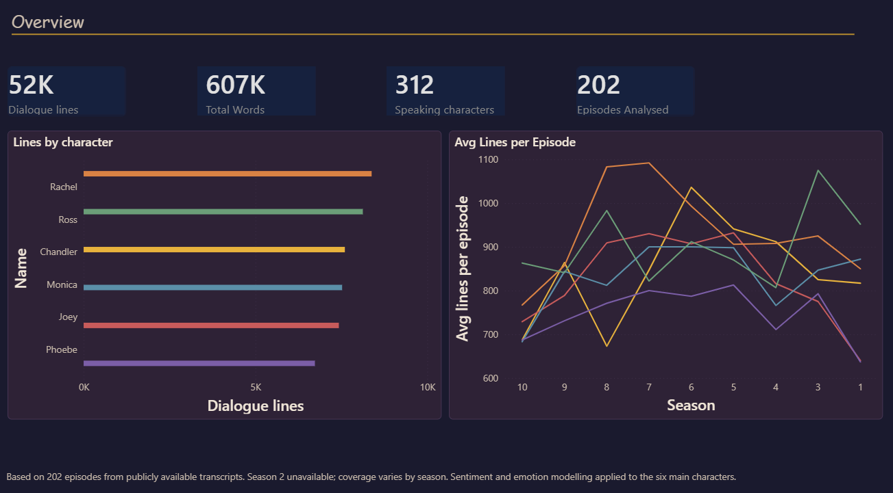
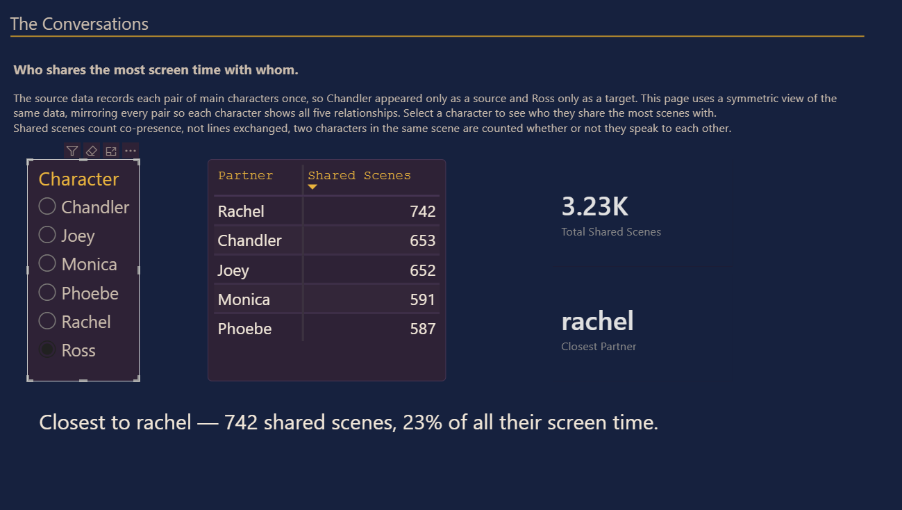
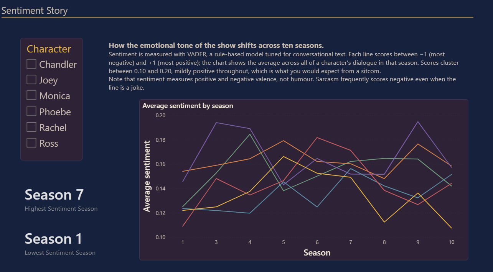
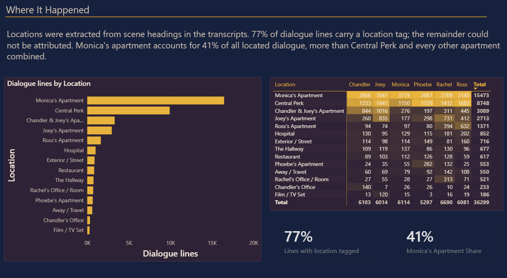
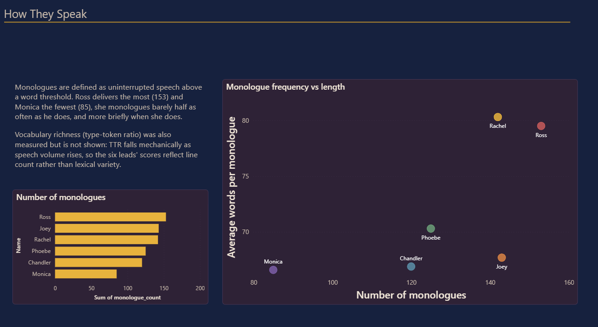

# Friends — Dialogue Analytics

An end-to-end analysis of 54,008 lines of dialogue from *Friends* (1994–2004): HTML transcripts, through cleaning and NLP enrichment, to a five-page Power BI dashboard.



---

## Pipeline

| Stage | Tool | Output |
|---|---|---|
| Scrape & parse | R — `rvest`, XPath | Line-level rows: season, episode, scene, writer, character, dialogue |
| Clean | Python — pandas, re | 54,008 canonical lines, 16 normalised locations |
| Sentiment | Python — VADER | Compound score per line, −1 to +1 |
| Emotion | Python — DistilRoBERTa | 7-class label, main cast |
| Derived metrics | Python — pandas | Interaction network, monologues, vocabulary richness |
| Model | Power BI — DAX | Star schema with two dimension tables |
| Dashboard | Power BI | 5 pages |

---

### Scraping and parsing

Episode transcripts were held as local HTML files named by season and episode (`0101.html`). Each was parsed with `rvest` and XPath.

Three things had to come out of each page:

**Writer attribution** — source pages use nine different header forms (`Written by:`, `Story by:`, `Part 1 written by:` and others), so the XPath predicate is built dynamically from the full set rather than matching one pattern.

**Scene boundaries** — headers matching `[Scene: ...]` were extracted first, then the paragraph nodes walked in order, incrementing a scene counter whenever a header was hit. This is what gives every dialogue line a scene index, and it is what makes the co-occurrence analysis possible later.

**Dialogue** — paragraphs matching `^[A-Za-z]+:` were split on the first colon into speaker and line.

An earlier exploratory pass in R Markdown — tidytext, Bing and AFINN sentiment lexicons, ggplot2 — was used to work out which questions were worth pursuing. The Power BI dashboard supersedes it, and the source is not published here as it reproduces dialogue text in full.

```r
for (i in seq_along(dialogue_nodes)) {
  full_text <- html_text(dialogue_nodes[i])
  if (full_text %in% scenes) {
    scene_counter <- which(scenes == full_text)
  } else if (str_detect(full_text, "^[A-Za-z]+:")) {
    split_text <- str_split(full_text, ":\\s*", n = 2)[[1]]
    characters <- c(characters, split_text[1])
    dialogues  <- c(dialogues,  split_text[2])
    scene_indices <- c(scene_indices, scene_counter)
  }
}
```

---

## The dataset

**54,008 lines · 214 episodes · 312 speaking characters · 63 credited writers · 16 canonical locations**

Main cast line counts: Rachel 8,558 · Ross 8,403 · Chandler 7,772 · Monica 7,765 · Joey 7,599 · Phoebe 6,866

### Schema

| Column | Type | Description |
|---|---|---|
| `Season` | int | 1–10 |
| `Episode` | int | Episode number within season |
| `EpisodeLabel` | str | `S01E01` |
| `WrittenBy` | str | Credited writer(s), normalised |
| `Scene` | str | Raw scene header from transcript |
| `Location` | str | Canonical location |
| `Character` | str | Lowercased character name |
| `IsMainCharacter` | bool | True for the six leads |
| `IsChorusLine` | bool | True for lines attributed to `all` |
| `Dialogue` | str | Cleaned text |
| `WordCount` | int | Words in the line |

### Cleaning

The raw parse needed substantial work before it was usable.

**Text.** 15,423 lines carried embedded `\r\n` from HTML line wraps, collapsed to single lines. Windows-1252 smart-quote artifacts (`\x92`) replaced throughout.

**Character names.** Lowercased and trimmed. Source transcripts contained recurring typos — `mnca` for monica, plus `racheal`, `phoebs`, `chandlerv` — and inconsistent formal forms (`dr. geller`, `mr. geller`, `joey tribbiani`). Group lines attributed to `all` were flagged via `IsChorusLine` rather than dropped, so they stay countable but excludable.

**Locations.** The raw `Scene` field held 100+ variants of the same handful of places: `Monica and Rachel's`, `Monica and Chandlers`, `Monica and Chandler's apartment`, and bare `Monica` all refer to one apartment. Locations were regex-extracted from the `[Scene: ...]` header and mapped to 16 canonical names, with anything under 200 lines consolidated into `Other`.

**Writers.** 85 raw variants reduced to 63. Separators standardised (`and`, `,` → ` & `), misspellings corrected (`Kaufmann` → `Kauffman`, `Astroff` → `Astrof`).

**Excluded.** 177 rows with null season/episode — a Conan O'Brien behind-the-scenes special and unmatched fragments — split into `friends_special_episodes.csv`. Six rows with empty dialogue dropped.

---

## NLP enrichment

**VADER** on all lines. Rule-based and tuned for conversational text, which fits dialogue better than models trained on reviews or formal prose. Compound scores bucketed at the conventional ±0.05 thresholds.

**DistilRoBERTa** (`j-hartmann/emotion-english-distilroberta-base`) for seven-class emotion — joy, anger, sadness, fear, surprise, disgust, neutral — run on main-cast lines in batches of 32 with 512-character truncation. Scoping to the leads was deliberate: emotion trends across a character with three lines are noise.

**Derived tables:**

```python
# Monologues — 50-word threshold
df['is_monologue'] = df['WordCount'] >= 50

# Scene co-occurrence between leads
scene_groups = (df[df['IsMainCharacter']]
    .groupby(['Season','Episode','Scene'])['Character']
    .apply(lambda x: list(set(x))))

for a, b in combinations(sorted(chars), 2):
    edges.append({'source': a, 'target': b})
```

---

## Data modelling

All six aggregate tables keyed on `Character`, producing many-to-many relationships in every direction. That schema returns different totals depending on which filter path Power BI picks, and eventually refuses new relationships with ambiguity errors.

Two dimension tables were built in DAX, deriving their key sets from the union of every fact table so no character or season could be silently dropped:

```dax
DimCharacter =
DISTINCT(
    UNION(
        SELECTCOLUMNS(Dialogue,       "Character", Dialogue[Character]),
        SELECTCOLUMNS(Sentiment_Agg,  "Character", Sentiment_Agg[Character]),
        SELECTCOLUMNS(Emotion_Agg,    "Character", Emotion_Agg[Character]),
        SELECTCOLUMNS(Vocab,          "Character", Vocab[Character]),
        SELECTCOLUMNS(Monologues,     "Character", Monologues[Character])
    )
)
```

All relationships were rebuilt one-to-many, single-direction, radiating outward from the dimensions. Slicers bind to the dimensions rather than the facts, so one selection filters all six tables consistently.

### The interaction asymmetry

The co-occurrence builder uses `combinations(sorted(chars), 2)`, storing each pair once in alphabetical order. Chandler therefore only ever appeared as `source`, Ross only ever as `target`.

Read directly, this would have made Chandler the most connected character in the show — as a pure artifact of the alphabet.

A symmetric view was built by unioning the table with itself, swapped:

```dax
InteractionsFull =
UNION(
    SELECTCOLUMNS(Interactions,
        "Character", Interactions[source],
        "Partner",   Interactions[target],
        "SharedScenes", Interactions[shared_scenes]),
    SELECTCOLUMNS(Interactions,
        "Character", Interactions[target],
        "Partner",   Interactions[source],
        "SharedScenes", Interactions[shared_scenes])
)
```

Every character now shows all five relationships, and totals are comparable.

---

## Findings

**The show is domestic, not a coffeehouse.** Monica's apartment carries 41% of all located dialogue — 15,473 lines against Central Perk's 8,748, and more than every other apartment combined.

**Speaking time is uneven by about a quarter.** Rachel leads with 8,558 lines against Phoebe's 6,866 — a 25% gap across an ensemble that ran a decade.

**Monologue habits diverge sharply.** Ross delivers 153 monologues to Monica's 85, and at greater average length. Plotting frequency against length separates the cast into quadrants: Ross and Rachel speak at length, Monica rarely and briefly, Joey often but short.

**Sentiment barely moves.** Average VADER compound sits between 0.10 and 0.20 for every character in every season. Season 7 scores highest, season 1 lowest, but the range is narrow enough that the honest summary is stability, not trend.

---

## Limitations

**Season 2 is partial and excluded.** Only 12 of ~24 episodes were successfully scraped. Rather than present a season at half coverage alongside complete ones, it is filtered out of the dashboard, which reports 202 episodes. The data remains in the dataset for anyone who wants it.

**Coverage varies across the remaining seasons**, so cross-season comparisons use per-episode averages rather than totals.

**Sentiment is not humour.** VADER measures valence. Sarcasm — a substantial part of at least one character's entire register — routinely scores negative even when the line is a joke. No claim is made here about which season is funniest, because this data cannot support one.

**Vocabulary richness was measured and excluded.** Type-token ratio falls mechanically as speech volume rises: more lines means more repetition means a lower ratio, regardless of actual lexical variety. The six leads' TTR scores tracked their line counts almost exactly, so the metric was computed, judged confounded, and left out rather than presented as a finding.

**Shared scenes are co-presence, not conversation.** Two characters in a scene are counted whether or not they address each other.

**The `Other` location bucket holds ~12K rows** of one-off places — hotels, Barbados, the rest stop. Fine in aggregate, not usable for granular location work.

**388 rows have no scene header** preceding them in the transcript; their location is `Unknown`.

**Sentiment and emotion cover the six leads only.** The corpus holds 312 speaking characters.

---

## Dashboard

| Page | Question |
|---|---|
| Overview | How much data is here, and how is it distributed? |
| The Conversations | Who shares the most screen time with whom? |
| Sentiment Story | Does emotional tone shift across ten seasons? |
| Where It Happened | Where does the show actually take place? |
| How They Speak | Who monologues, how often, at what length? |






A custom theme (`powerbi/friends_analytics_theme.json`) fixes six character colours applied consistently across every page, so a colour means the same thing wherever it appears.

**To explore:** download `powerbi/friends_analytics.pbix` and open in [Power BI Desktop](https://powerbi.microsoft.com/desktop/) (free).

---

## Repository

```
├── notebooks/
│   └── friends_enrichment.ipynb     VADER, DistilRoBERTa, derived tables
├── data/processed/                  Six aggregate tables + special episodes
├── powerbi/
│   ├── friends_analytics.pbix
│   └── friends_analytics_theme.json
└── images/                          Dashboard screenshots
```

The full line-level dataset is not committed — it reproduces the show's dialogue in full. The processed aggregates are derived statistics and are included so the dashboard can be explored without re-running the pipeline.

---

## Further work

**Join episode ratings.** The question this project does not answer is whether emotional tone relates to how audiences received an episode. Joining IMDb ratings on season-episode would turn a descriptive analysis into a testable one.

**Line-level interaction parsing.** Reconstructing who speaks *to* whom, rather than who is merely present, would give a genuine conversation network.

**Recover season 2.** Half its episodes failed to scrape; a second pass against a different transcript source would complete the corpus.

---

## Acknowledgements

Transcripts sourced from fan-maintained HTML episode pages. All content rights belong to Warner Bros. and Bright/Kauffman/Crane Productions. This project is for educational and portfolio use.

---

**Stack:** R (rvest, dplyr, stringr) · Python (pandas, VADER, HuggingFace Transformers) · Power BI · DAX · Power Query